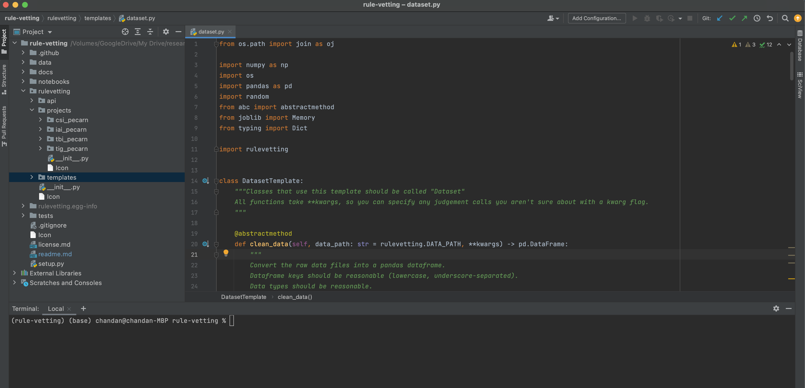

<h1> CDR vetting </h1>

*press esc to navigate slides*

**stat 215 final project**

[](https://github.com/Yu-Group/rule-vetting)


## logistics

- deadline: dec 12
- meeting with clinician: once week of 12/15, once week of 12/295


# project details

## helpful links

1. [project checklist](https://github.com/Yu-Group/rule-vetting#contributing-checklist)
2. [lab writeup details](https://github.com/Yu-Group/rule-vetting/blob/master/docs/lab_writeup.md)
3. [clinical collaboration details](https://github.com/Yu-Group/rule-vetting/blob/master/docs/collaborating_for_data_scientists.md)

## understanding the problem

- outcome is already selected for you

## understanding the data

- what features might be useful?

## modeling


## writeup

- checking stability and judgement-calls

## 

# data-science in python

## setting up python

- `python --version` should give 3.7 or higher (might need to type `python3`)
- easier if you install things by making a [venv](https://docs.python.org/3/tutorial/venv.html)
- you can use any editor, maybe jupyterlab or [pycharm](https://www.jetbrains.com/pycharm/)
- 

## installation

```bash
git clone https://github.com/Yu-Group/rule-vetting
cd rule-vetting
python setup.py sdist
pip install -e .
```


## core packages

- numpy
- pandas


# custom CDR packages

## 🔎 imodels


## usage

```python
from imodels import CorelsRuleListClassifier
model = CorelsRuleListClassifier()
model.fit(X_train, y_train)
preds = model.predict(X_test)
preds_proba = model.predict_proba(X_test)
print(model)
```


## 

package for facilitating PCS analysis, especially stability

