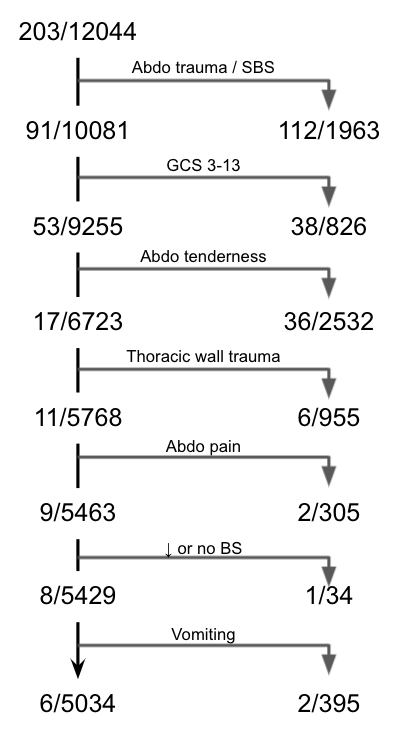
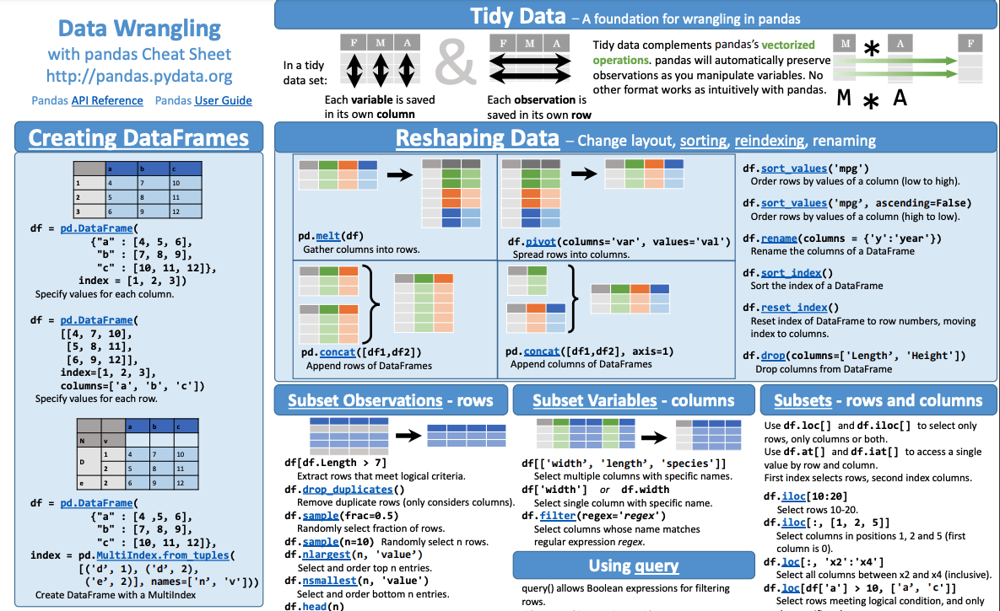

<h1> CDR vetting </h1>

*press esc to navigate slides*

**stat 215 final project**

[](https://github.com/Yu-Group/rule-vetting)


## logistics

- deadline: dec 12 - don't wait!!
- meeting with clinician: once week of 11/15, once week of 11/29
- optional group presentations after the deadline
- will we write a paper?

# project overview

1. [project checklist](https://github.com/Yu-Group/rule-vetting#contributing-checklist)
2. [lab writeup details](https://github.com/Yu-Group/rule-vetting/blob/master/docs/lab_writeup.md)
3. [clinical collaboration details](https://github.com/Yu-Group/rule-vetting/blob/master/docs/collaborating_for_data_scientists.md)

## understanding the problem

- outcome/data are already selected for you
- what is important to capture in a CDR for this problem?

## understanding the data

what features are reliable/useful/predictive?

## modeling



## writeup

- checking stability and judgement-calls
- comparison with baseline model


# basic setup

## fork the repo

make fork private + include your teammates


## why are we using python 🐍?

python is better

## [R to python](https://towardsdatascience.com/essential-guide-to-translating-between-python-and-r-7cb18b786e5d)

indentation matters!

| python                    | R                               |
| -- | -- |
| `a=5`                     | `a <- 5`                        |
| `pip install packagename` | `install.packages(packagename)` |
| `import packagename`      | `library(packagename)`          |
| `listname[0]` | `listname[1]` |

## setting up python

- `python --version` should give 3.6 or higher (might need to type `python3`)

- easier if you install things by making a [venv](https://docs.python.org/3/tutorial/venv.html)

```C
python3 -m venv rule-env  // create the env
source rule-env/bin/activate  // activate the env
```


## installation

```bash
git clone https://github.com/Yu-Group/rule-vetting  // clone the repo
cd rule-vetting
pip install -e .
```

## editing in python

you can use any editor, maybe [jupyterlab](https://jupyterlab.readthedocs.io/en/stable/) or [pycharm](https://www.jetbrains.com/pycharm/)


# core data-science packages in python

pandas, numpy, sklearn, seaborn/matplotlib

## [pandas](https://pandas.pydata.org/)




## [numpy](https://numpy.org/)


## [seaborn](https://seaborn.pydata.org/) / [matplotlib](https://matplotlib.org/)

```python
sns.lmplot(x="x", y="y", col="dataset", hue="dataset", data=df,
           col_wrap=2, ci=None, palette="muted", height=4,
           scatter_kws={"s": 50, "alpha": 1})
```


## [scikit-learn](https://scikit-learn.org/stable/index.html)


## scikit-learn example

```python
from sklearn import tree
X = [[0, 0], [1, 1]]
Y = [0, 1]
clf = tree.DecisionTreeClassifier()
clf = clf.fit(X, Y)
clf.predict([[2., 2.]])
```

# custom CDR packages

## 🔎 [imodels](https://github.com/csinva/imodels)


## imodels usage

```python
from imodels import RuleFitClassifier
model = RuleFitClassifier()
model.fit(X_train, y_train)
preds = model.predict(X_test)
preds_proba = model.predict_proba(X_test)
print(model)
```


## 

package for facilitating PCS analysis, especially stability

## vflow usage

- implemented in the dataset template - will help speed things up for you

# project specifics

[project checklist](https://github.com/Yu-Group/rule-vetting#contributing-checklist)


## quick start

- look at the example project ([iai_pecarn](https://github.com/Yu-Group/rule-vetting/tree/master/rulevetting/projects/iai_pecarn))
- look at the template files
- probably just start with some notebooks and then implement template functions


## understanding the template


## specifying judgement calls


## ex function with a judgement call


## tests

`pytest --project <your_project_name>`

e.g. `pytest --project iai_pecarn`


## [ex notebooks](https://github.com/Yu-Group/rule-vetting/tree/master/rulevetting/projects/iai_pecarn/notebooks)
