`GENERAL NOTE: should we refer to the notebooks in the repo that we used to make some of the plots?`

```{r setup, echo = FALSE}
library(knitr)

library(reticulate)
reticulate::use_python("../../../rule-env/bin/python3", required = FALSE)
reticulate::use_virtualenv("../../../rule-env/", required = FALSE)
knitr::knit_engines$set(python = reticulate::eng_python)
knitr::opts_chunk$set(engine.path = list(python = "../../../rule-env/bin/python3"))
```

# Introduction and Problem Motivation

Among children ages 0-14, traumatic brain injuries (TBIs) are a leading cause of injury and death,
accounting for over 2100 deaths, 35,000 hospital admissions, and 470,000 emergency
department visits annually (Faul, Xu, Wald, & Coronado, 2010). Accurately diagnosing TBIs is thus a crucial
problem, especially since the earlier a TBI is identified, the sooner potentially life-saving
treatment can be administered. 

Typically, TBIs are diagnosed via computed tomography (CT)
scans of a patient's brain. However, performing CT scans carries the risk of radiation-induced malignancy in the patient.
This risk is especially pertinent for children, as younger individuals are at a higher
risk of developing such malignancies. Therefore, while it is crucial to rapidly and
accurately diagnose TBIs, it is also imperative that CT scans are performed only when
there is reasonable suspicion the individual has a TBI. Otherwise, the risk of
radiation-induced complications from the CT scan will outweigh any potential benefit
of having CT scan results.

Nathan Kuppermann and his colleagues explored this problem in their 2009 Lancet paper
("Identification of children at very low risk of clinically-important traumatic brain injuries after
head trauma: a prospective cohort study"), seeking to develop interpretable rules
that could be used to identify children, who, despite presenting to the emergency room
for head trauma, are at low risk of having TBIs and thus can avoid CT scans. The purpose
of this present study is to build on their work, developing alternative classification
schemes and rule sets to identify children for whom CT scans are unnecessary. With an
alternative scheme with high predictive accuracy, one can compare with Kuppermann's to see
if similar rules were isolated, either reinforcing the importance of their identified covariates,
or providing a new perspective on what is important in predicting TBI. Additionally,
in this analysis, we employ our own data cleaning and preprocessing scheme that we find
reasonable, allowing us to assess the stability of their findings subject to perturbations
at this stage of the data science life cycle.

In addition to vetting their classification rules, another goal of this analysis
is to offer some improvement on their classification strategy. Kuppermann and his
colleagues developed rule sets for children aged younger than two and children
aged two or older, the reason being that younger children are pre-verbal and thus require
a different set of standards to identify TBIs than older children who can verbalize
their symptoms (citation). We seek to develop a single age-invariant
classifier using covariates common to both primary age groups. We hope that such
a classifier will not only identify common predictors of TBI across all ages, but also
simplify the decision-making process by obviating the need for a second classifier.
Nonetheless, in developing new classifiers, priority will be placed on interpretability, 
brevity and simplicity, and a low false negative rate. 

# Data

## Data Collection

Before going into extensive detail about the dataset used in this analysis, as
well as our cleaning and preprocessing steps, we first offer our own thoughts
on what data would be most relevant for vetting previous classifiers and developing
an age-invariant classifier. 

Besides needing a dataset similar in nature
to the dataset on which the original classifiers were based (comprised of children
presenting to ER with head trauma, etc.), to vet the previous
classifiers, we need a dataset that will enable us to develop classifiers with
high predictive accuracy and maximal generalizability so as to compare with previous classifiers. 
For instance, we would need a dataset containing covariates that are both relevant to the presence
of TBIs and can be measured at the time a child is ushered into the ER. From common
sense, as well as consulting with Dr. Robert Inglis of UCSF, it seems important 
information might be the injury mechanism (and a rating of
severity), any symptoms such as headache or amnesia, and any results of a physical
examination that may indicate neurological impact or skull injury. For both
vetting the clinical decision rule and developing an age-invariant rule, it would
be preferable to have covariates that are as objective as possible so as to avoid
issues with interrater reliability and improve generalizability of the rules to 
new, real-world settings. It would also be preferable to both have details on covariates 
invariant to gender, race, ethnicity, or any other such characteristic
of the population of interest and a population with gender, age, and racial diversity,
to reduce the potential of systematic misdiagnoses in these groups
should the rule be applied in future settings. Finally, we wish to identify children
who do not need CT scans among a population where there is already some doubt
as to whether the CT scan will be worth the risk of radiation induced malignancy.
So, the ideal dataset will consist of children who are not critically injured
and who could conceivably be TBI-free.

To develop an age-invariant classifier, the above points are certainly relevant.
However, specific to an age-invariant classifier, we would also need covariates
whose presence or values are not age-dependent.

The dataset used in this analysis is the same one used by Kuppermann and his colleagues
to develop their classification rules, consisting of 43399 children who presented
to the emergency room for head trauma at one of the PECARN network hospitals
between 2004 and 2006. For each
child, the data were collected by physicians who filled out standardized sheets detailing the
child's condition, including both questions for the child ('Do you have a headache?')
and results of a physician examination ('Palpable skull fracture?'). Additionally,
the dataset contains information that would be available after the decision to
pursue a CT scan has been made, such as the reasons why a CT scan is being pursued,
whether a child will need to be sedated for a CT scan, and whether there were 
any traumatic findings on the scan. The outcome variable (TBI) was obtained by
tracking the child's progress in the hospital after the initial examination 
(whether they were admitted for neurological surgery, or died in the ED, for example)
or, if the child left the hospital, following-up with the child's parents, the medical record,
emergency department process improvement records, and county morgue records to ensure
no TBI diagnoses were missed. In total, there are 125 covariates, including the outcome.

It seems that in this dataset, most of the variables we conjecture are important
for predicting TBIs are present, but that there are many covariates whose information
would not be known at the time our classifier would be implemented. Additionally,
many covariates seem more objective than others ('Palpable skull fracture?' vs. 
'Is the child acting normally?'). There are also many variables which are not invariant
to age. For instance, the ability to say you have a headache is reserved for verbal
children who must be above a certain age. These variables and decisions on what to do
with them will be discussed at length in Cleaning and Preprocessing, as well as
Post-Processing EDA. The dataset also provides demographic characteristics such as
age, gender, race, and ethnicity. This information will be discussed at length in 
Post-Processing EDA.

## Cleaning and Preprocessing

`TODO: instead of referring to what happens in AMS all the time, write it above and refer to it generally`

In order to achieve a suitable dataset for the predicting low risk of TBI
in children according to the above parameters, we first implement a set of
cleaning and preprocessing steps. The overarching goal of our cleaning
and preprocessing steps is to keep only covariates relevant to predicting TBI
at the time a child would present to the ER, keep only observations for whom
this classification rule would be relevant (children for whom it's a toss-up
as to whether they'll need a CT scan), and to deal with missing values. We present
our procedure below, along with relevant judgment calls and their perturbations
where applicable.

* Remove columns irrelevant to predicting TBI at the time a child enters the emergency room
  + *EmplType*, *Certification*, *Ind...*, *CT...*, *Finding1*, ... *Finding23*, *EDDisposition*, *Observed*, *AgeTwoPlus*, *AgeInMonth*
  + Judgment Call [`injMech`]: drop *InjuryMech* 
    + Perturbation: keep *InjuryMech* 

This includes *EmplType* and *Certification*, any variable about the reasons why a CT scan was ordered, whether sedation would be needed when performing a CT scan, the traumatic findings from the CT scan, the reason why the child left the ER, or 
whether the child was observed again to see if they needed a CT scan. 
We remove the former two variables because domain knowledge
says that we should not expect the qualifications of the physician to systematically
affect the responses collected. The rest of the variables would either not be available
at the time a child first enters the ER, or would be known only after
the decision to obtain a CT scan has been made. So, these are not of interest.
We also remove an indicator for the individuals being above age 2, as well as
the age provided in months, opting to keep the age provided in years. Similarly,
according to judgment call [`injMech`], we drop the injury mechanism, a 13-level categorical variable detailing how the
injury occurred, opting to keep a severity variable, a 3-tiered categorical variable
rating the severity of the injury mechanism as 'low', 'moderate', or 'high'.

* Remove columns with high levels of missingness
  + *Dizzy*, *Ethnicity*

*Dizzy*, an indicator of whether the individual felt dizzy, and *Ethnicity*,
whether the individual was Hispanic, are both missing in approximately 35% of the
observations. *Ethnicity* would be useful for posthoc analysis, but with such a large
number of missing values, it may not be particularly informative. *Dizzy* could be
a good indicator of TBI, but was deemed too subjective and prone to inter-rater reliability
issues according to both Kupperman et al. and Dr. Inglis.

* Remove observations whose *GCS* scores are less than 14

GCS, or Glasgow Coma Score, measures an individual's level of consciousness on a scale from 3 to 15,
and is the sum total of three subscores: an eye score, a verbal score, and a motor score.
If GCS is less than 14, the individual is quite injured and would likely need a CT scan anyway.
We only keep individuals where the total GCS is 14 or 15.

* Impute and Drop based on GCS scores
  + Judgment Call [`missSubGCS`]: drop observations with total GCS of 14, but missing any of the GCS subcategory scores (*GCSVerbal*, *GCSMotor*, *GCSEye*) 
    + Perturbation: keep the observations
  + Impute a full score into each GCS subcategory when total GCS is 15 
  + Judgment Call [`fake15GCS`]: drop observations with total GCS of 15, but suboptimal score in a subcategory 
    + Perturbation: keep the observations
  + Judgment Call [`fake14GCS`]: drop observations with total GCS of 14, but optimal score in every subcategory 
    + Perturbation: keep the observations
  
GCS score is likely an important predictor of TBI, so it is imperative this variable is as completely 
filled-out as possible in this dataset. However, it should be noted that
there are different standards for obtaining GCS scores for individuals younger than two
and those two or older, since individuals younger than two cannot verbalize. We note this
as a potential problem to developing an age-invariant classifier.

* Remove observations who were pharmacologically paralyzed, sedated, or intubated at the time of evaluation, or for whom any of this information is missing
  + *Paralyzed*, *Sedated*, *Intubated*
  
According to domain knowledge, individuals who must be pharmacologically paralyzed, 
sedated, or intubated at the time of evaluation are likely quite injured and do not 
represent the population of interest for these classification rules.

* Drop and impute based on variables of altered mental status
  + *AMS*, *AMSAgitated*, *AMSSleep*, *AMSSlow*, *AMSRepeat*, *AMSOth*
  + Judgment Call [`AMS`]: drop observations missing any of the above variables
    + Perturbation: impute missing *AMS* based on presence of any of the subvariables, and drop the subvariables and any remaining missing *AMS* observations
    
*AMS* is an indicator representing if the child has altered mental status, and
the remaining variables are subvariables indicating the reason why the child has
altered mental status (agitated, sleepy, slow to respond, asking repetitive questions, etc.)
This is likely an important predictor, so it is important to handle missing values.
By judgment call `AMS`, we drop any observation with a missing value in any of these
categories, since if the observation is missing it is impossible to truly know a value
to impute for *AMS*. As a perturbation, we could impute a 1 in *AMS* if any
if any of the subcategories is affirmative, and 0 otherwise. However, it would
be impossible to impute for missing values in the subcategories, so we drop
these observations.

* Drop and impute based on variables of other non-head substantial injuries
  + *OSI*, *OSIExtremity*, *OSICut*, *OSICspine*, *OSIFlank*, *OSIAbdomen*, *OSIPelvis*, *OSIOth*
  + Judgment Call [`OSI`]: same procedure as above for *AMS* and its subvariables
    + Perturbation: same procedure as above for *AMS* and its subvariables
    
*OSI* is an indicator on whether the physician determined the child sustained 
substantial non-head injuries. This could be an injury to the extremities like a fracture,
a cut requiring surgery, a spinal cord injury, a flank injury, an intra-abdominal injury,
or a pelvis injury. Although not directly related to head trauma, we find this variable
might be an indicator of the injury severity. If another variable relevant to head trauma
fails to indicate a TBI for a particular individual, including this variable offers
another opportunity to diagnose the TBI, possibly suppressing the false negative rate.
By judgment call `OSI`, we drop any observations missing any of these values or their
subvariables for the same reason as judgment call `AMS`. 

* Drop and impute based on hematoma information
  + *Hema*, *HemaSize*, *HemaLoc*
  + Judgment Call [`HEMA`]: same procedure as above for *AMS* and its subvariables
    + Perturbation 1: same procedure as above for *AMS* and its subvariables
    + Perturbation 2: Only drop missing *HemaLoc* and *Hema*, impute missing *Hema* from *HemaLoc* presence, drop remaining missing *Hema*
    
*Hema* indicates the presence of a scalp hematoma, or swelling due to some head trauma,
*HemaSize* is a categorical variable representing the size (< 1cm, 1-3cm, > 3cm) and
*HemaLoc* is a categorical variable representing the location (frontal, occipital, parietal/temporal).
According to domain knowledge, scalp hematomas are fairly good predictors of TBI.
By judgment call [`HEMA`], we drop all observations missing any of these categories.
By Perturbation 1, we only keep the indicators for the presence of hematoma. By Perturbation 2, we keep the indicator as well as the location, 
since according to domain knowledge, the impact of head trauma to the brain is dependent on the location of the trauma.

* Drop and impute based on skull fracture variables
  + *SFxPalp*, *SFxPalpDepress*
  + Judgment Call [`SFx`]: recode an unclear *SFxPalp* observation as true, drop observations missing either *SFxPalp* or *SFxPalpDepress*
    + Perturbation 1: same procedure as [`AMS`] perturbation
<<<<<<< HEAD
    + Perturbation 2: recode an unclear *SFxPalp* observation as false, drop observations missing either *SFxPalp* or *SFxPalpDepress*
=======
    + Perturbation 2: same procedure as [`AMS`] judgment call
>>>>>>> c840e49c7a7ef202671d228365747ab983030469
    
*SFxPalp* is an indicator for a palpable skull fracture, which can also be marked as
'unclear' if there is too much swelling to make a determination. *SFxPalpDepress*
is an indicator on whether the fracture feels depressed. Both of these are likely
important predictors via domain knowledge. As a judgment call, we take an unclear
observation as being a palpable skull fracture, since even if the examination was unclear,
there is still substantial head trauma.

* Drop missing values for bulging Anterior Fontanelle
  + *FontBulg*

*FontBulg* is an indicator for whether the child's anterior fontanelle is bulging,
indicating pressure within the brain. This feature would typically only be present in
infants, since for older individuals their anterior fontanelle will have closed as their
skull hardens with age. While possibly a good predictor for TBI in infants, this
variable does not have much predictive value for older children.

* Drop and impute based on basilar skull fracture variables
  + *SFxBas*, *SFxBasHem*, *SFxBasOto*, *SFxBasPer*, *SFxBasRet*, *SFxBasRhi*
  + Judgment Call [`SFxBas`]: same as [`AMS`] judgment call
    + Perturbation: same as [`AMS`] perturbation

*SFxBas* is an indicator if the physician has determined there is basilar skull fracture
present, or a fracture at the base of the skull. The rest of the variables indicate
common indicators of basilar skull fracture (hemotympanum, otorrhea, raccoon eyes, Battle's sign, rhinorrhea).
More specifically, hemotympanum is when blood is found in the middle ear, otorrhea is when spinal fluid drains
from the ear, raccoon eyes is when internal bleeding occurs below the eye, Battle's sign is a bruise at the 
bottom of the skull, and rhinorrhea is when spinal fluid leaks out the nose.
This is known to be quite an important predictor of
TBI, so we wish to make these variables as complete as possible for an ideal dataset.
To do so, we follow the same procedure for *AMS* and its subvariables, regarding missingness.

* Drop and impute based on above-the-clavicle injury variables
  + *Clav*, *ClavNeck*, *ClavFro*, *ClavOcc*, *ClavPar*, *ClavTem*
  + Judgment Call [`Clav`]: same as [`AMS`] judgment call
    + Perturbation: same as [`AMS`] perturbation

*Clav* is an indicator on whether there was a laceration, abrasion, or hematoma
above the clavicles (neck). The subvariables indicate whether there was trauma on
the neck or the frontal, occipital, parietal or temporal regions of the scalp.
In the same way as *OSI*, this variable will be useful to keep around because it
could indicate a TBI if one of the head trauma variables fails to.

* Drop and impute based on neurological deficit variables
  + *NeuroD*, *NeuroDMotor*, *NeuroDSensory*, *NeuroDCranial*, *NeuroDReflex*, *NeuroDOth*
  + Judgment Call [`Neuro`]: same as [`AMS`] judgment call
    + Perturbation: same as [`AMS`] perturbation
    
*NeuroD* is an indicator for whether or not there is some neurological deficit
besides altered mental status, as determined by the physician. This includes
motor, sensory, cranial nerve (pupil reactivity), or reflex issues. Generally,
these categories are quite important for predicting TBI according to domain knowledge.
As with previous groups of variables, we implement a judgment call to drop
any observation missing any of these values.

* Drop and impute based on vomiting variables
  + *Vomit*, *VomitNbr*, *VomitStart*, *VomitLast*
  + Judgment Call [`Vomit`]: same as [`AMS`] perturbation
    + Perturbation: same as [`AMS`] judgment call

*Vomit* is an indicator for whether the individual vomited (as reported by child
or parents), *VomitNbr* is the number of times the child vomited post-injury (1, 2, > 2 times),
*VomitStart* is how soon after the head injury the vomiting started (within 1 hour, 1 - 4 hours, > 4 hours after), and 
*VomitLast* is how soon before the evaluation was the last
episode (< 1 hour, 1 - 4 hours, > 4 hours before evaluation). As a judgment call,
we only keep *Vomit* and impute missing values from the subvariables, since according
to domain knowledge, more details about vomiting is generall unhelpful. As a perturbation,
we keep these covariates.

* Drop and impute based on headache variables
  + *HA_verb*, *HAStart*, *HASeverity*
  + Judgment Call [`HA`]: Drop missing *HASeverity*, impute missing *HA_verb* from *HASeverity*, and drop remaining missing *HA_verb*, ignore *HAStart* column 
    + Perturbation 1: same as [`AMS`] perturbation
    + Perturbation 2: same as [`AMS`] judgment call
    
*HA_verb* is an indiactor on whether the child had a headache, and is marked differently
if the child is too young to verbalize that they had a headache, or unable to speak.
*HAStart* and *HASeverity* are both variables indicating when the headache began
(before injury, within 1 hour after, 1-4 hours after, > 4 hours after) and the severity
(mild, moderate, and severe). As a judgment call, we keep *HA_verb* and *HASeverity*
since these are both more likely to predict TBI than *HAStart*. However, it should be
noted that this is an age-dependent variable as discussed in the prior section, since
being able to verbalize headache symptoms requires the child to be of a certain age.

* Drop and impute based on seizure variables
  + *Seiz*, *SeizLen*, *SeizOccur*
  + Judgement Call [`Seiz`]: Drop missing *SeizLen*, impute missing *Seiz* from *SeizLen*, drop missing *Seiz*, and ignore *SeizOccur* column
    + Perturbation: Drop missing *SeizLen* and *Seiz*, exclude *SeizOccur* column
  
*Seiz* is an indicator if the child had a seizure, as reported by the parent or child.
*SeizLen* is how long the seizure lasted (< 1 min, 1-5 min, 5-15 min, >15 min) and
*SeizOccur* is when did it occur relative to the injury time (immediately on contact, 
within 30 minutes, or > 30 minutes after injury). Whether a seizure occured is 
important to consider, and the length is also somewhat important. So, we opt to
keep *SeizLen* and *Seiz*, but drop *SeizOccur*, since this is not as important
according to domain knowledge. 

* Drop and impute based on loss of consciousness variables
  + *LOCSeparate*, *LocLen*
  + Judgement Call [`LOC`]: recode 'suspected' as 'yes' in *LOCSeparate*, and drop observations with missing *LOCSeparate* and *LOCLen*
    + Perturbation 1: same as [`AMS`] judgement call
    + Perturbation 2: recode 'suspected' as 'no' in *LOCSeparate*, drop missing *LOCSeparate* and *LOCLen*
    
*LOCSeparate* is an indicator if the child lost consciousness at all after the injury,
and *LocLen* is how long the child lost consciousness (< 5 sec, 5 sec - 1 min, 1 - 5 min, > 5 min). 
Loss of consciousness is generally a good predictor of head trauma, so we wish
to include this to predict TBI. As a judgment call, we consider a suspected loss of
consciousness as affirmative, since if there is any doubt as to whether the child
lost consciousness, this should be of concern to err on the side of caution.

* Drop missing values for *Amnesia* and *High_impact_InjSev*

*Amensia* indicates whether the child has amnesia for the event, but can only
be answered by verbal children. This is an example of a variable that is not age-invariant,
although it could be a good predictor for verbal children. *High_impact_InjSev*
is the rating of the injury mechanism severity, as mentioned above. 

* Impute missing values for *ActNorm*
  + Judgment Call [`ActNorm`]: recode null values as affirmative
    + Perturbation: recode values as not affirmative

*ActNorm* is a subjective assessment by the parent as to whether the parent
thinks the child is acting normally. Although subjective, domain experts conclude
that a parents assessement of their child's behavior is a good indicator of
how severely the child may be injured. Because this is important, we wish to impute
as many values as possible. As a judgment call, we consider a missing value
as being normal, since if the child was acting normally, it's possible this
question could have simply been skipped over. As a perturbation, we reverse this
judgment call.

* Make a pooled outcome variable

We define the outcome, a clinically-important TBI, in the same way as Kuppermann
and his colleagues, except we impute missing values in the outcome by the
presence of any of the following: death due to TBI, intubated for more than 24 hours,
neurosurgery was performed, and the individual was hospitalized for more than 2 nights
due to head injury. This should give a complete assessment as to whether an individual
had a TBI.

## Data Summary

Once we have cleaned the data according to the above steps, we wish to extract
binary features from the categorical variables, where applicable. For every subvariable/
parent variable pairing mentioned above (for example, `NeuroDMotor` and `NeuroD`),
if the parent variable is marked as false, the subvariable has a value indicating
it is missing. As a default, we maintain this missing category, and binarize the variables
by one-hot encoding. Alternatively, we could impute false into the missing values
and drop the parent variables, so now each subvariable indicates the presence of the
subvariable AND the parent variable as opposed to the subvariable GIVEN the parent variable.

After performing this one-hot encoding, we have 137 features in total. We split 
the data into a training set (19947 observations), a validation set (6649 observations), 
and a test set (6649 observations). For post-processing EDA, we only consider
the training set, only using the test set to check model accuracy. We should note
that there may be cluster structure in the dataset by virtue of the data
being collected from different hospitals, presenting a possible comparability issue.
However, we are not provided with hospital information,
so we perform a random train-validation-test split.

## Exploratory Data Analysis

`TODO: change plot sizes`

Data Collection detailed a list of characteristics of an ideal dataset to vet and
improve upon the original decision rule, according to the goals outlined in Introduction
and Problem Motivation.
In this section, we explore the relevance of the cleaned and preprocessed data to answer
the question at hand, assessing how the data meets these ideals via exploratory plots. 
The results of our exploratory analysis
will then be used to motivate decisions regarding feature inclusion and sample splitting
as we build our classifiers.

Of course, the dataset already meets some of these conditions by virtue of our cleaning
process: the cleaned dataset only includes individuals with GCS scores of 14 or 15,
and individuals who were not so injured as to be intubated, pharmacologically paralyzed,
or sedated at the time of evaluation. Additionally, since we are using the same original
dataset as Kuppermann et al., where children presented to the ER with head trauma,
our results can be suitably compared to theirs. Furthermore, since our data was cleaned
differently from theirs, we get an added stability assessment of their decision rule for
free, a crucial element of vetting their work.

As mentioned in Data Collection, one of the primary criteria of a good dataset
for this problem is a dataset which is diverse in demographic characteristics,
including age, race, and gender. This is crucial for generalizability of our work,
as a classifier built from a dataset that is demographically lopsided could exhibit
unforeseen biases when exposed to more diverse data.

```{r demographics, echo = FALSE, fig.cap = 'Distributions of various demographic variables in the training dataset, after cleaning and preprocessing.', out.width = '100%'}
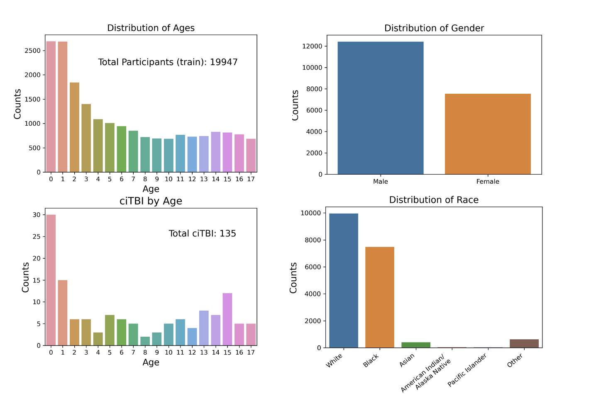
```


Figure \ref{fig:demographics} shows distributions of various demographic variables
in the cleaned training dataset. In the top-left plot, we see that younger ages
are generally represented more than older ages. However, younger children (2 or younger)
share many characteristics, including that they are likely preverbal, whereas older
children (older than 2) are likely verbal. With this split, it seems like there would
be sufficient representation for each age group. Regardless, there are at least 1500
observations for each age out of 19947 total observations, which we find to be sufficient
representation.

In the top-right plot, we see that there are about 8000 females and 12000 males in the dataset.
While we wouldn't expect different indicators for traumatic brain injury by gender,
the dataset is a bit lopsided in this regard; perhaps young boys tend to engage 
in more dangerous activities than young girls, and thus are at greater risk of head injury. 
Similarly, in the bottom-right plot we see that the vast majority of observations are White or Black, while
other races are quite underrepresented by comparison. Once again, we would not expect
a race-dependence of the indicators for TBIs, but like with the observed gender imbalance, 
we will explore the potential impact of this racial imbalance in Post-Hoc Analysis.

In the bottom left plot, we see that almost 20% of the TBIs observed are in children
aged 0, and that the number of TBIs decreases as age increases, flatlining on average
for children older than 2. Similarly with the age imbalance, 
if we were to split by young children versus older children, the number of TBIs in each age group
would be more balanced and likely sufficient to generate a classification rule.

While an imbalance in outcome across ages may skew our
age-invariant classifier to detect rules relevant for one age group versus another,
we should be careful to only include predictors whose relationships with the outcome
are invariant by age. The next few plots provide evidence of age dependence
and lack thereof for certain variables, motivating the use of certain features
for an age-invariant classifier. 

First, Figure \ref{fig:age_preverb} shows
the distribution of 'verbal' vs. 'non-verbal' or 'pre-verbal' in response
to the physician asking the child if they have amnesia or any headache symptoms.
We clearly see that, among children aged two or younger, more than 80% of them
were marked as non-verbal in response to both questions. So, a rule based on
whether or not the individual has a headache or amnesia would be useless for these
individuals. However, among children older than aged two, more than 90% of 
individuals were able to verbalize answers to these questions. These variables
would likely be good predictors of a TBI, so for a classifier only on older individuals,
these variables would be useful to include. However, they should not be included
in any classifier for younger children, or for an age-invariant classifier.

```{r age_preverb, echo = FALSE, fig.cap = 'Distributions of \'Verbal\' or \'Non-Verbal/Pre-Verbal\' responses to questions on amnesia and headache symptoms, by age.', out.width = "100%"}
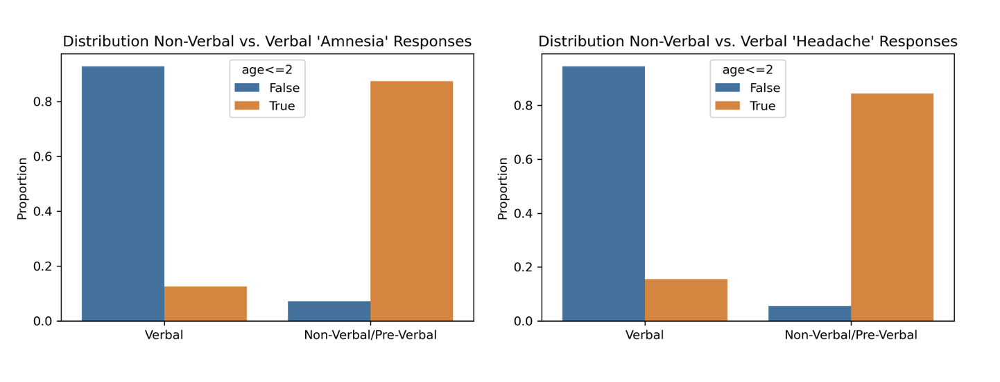
```

Next, we recall that, according to Kuppermann et al., for children two or younger,
a Pediatric GCS score was assigned, whereas for children older than two, a standard
GCS score was assigned. In essence, these are two different standards for evaluating
the consciousness of children, since children of different ages have different
abilities in expressing their consciousness. However, because the standards are
different across these two age groups, we fear that a suboptimal score with regard
to one standard might be more indicative of a TBI than a suboptimal score with respect
to the other standard. If GCS scores are included in an age-invariant classifier, 
this presents a potential comparability issue, where the rule that is learned may be
applicable to one age-group but not the other. Figure \ref{fig:gcs_age} shows the
distribution of the outcome variable for suboptimal versus optimal scores of each
GCS category (row) for the different age groups (column).

```{r gcs_age, fig.cap = 'Distributions of outcome among different GCS scores (row) for different age groups (column). 1 indicates optimal score in a GCS category, 0 is one point suboptimal (to achieve total GCS of 14 instead of 15).', echo = FALSE, out.width = "80%"}
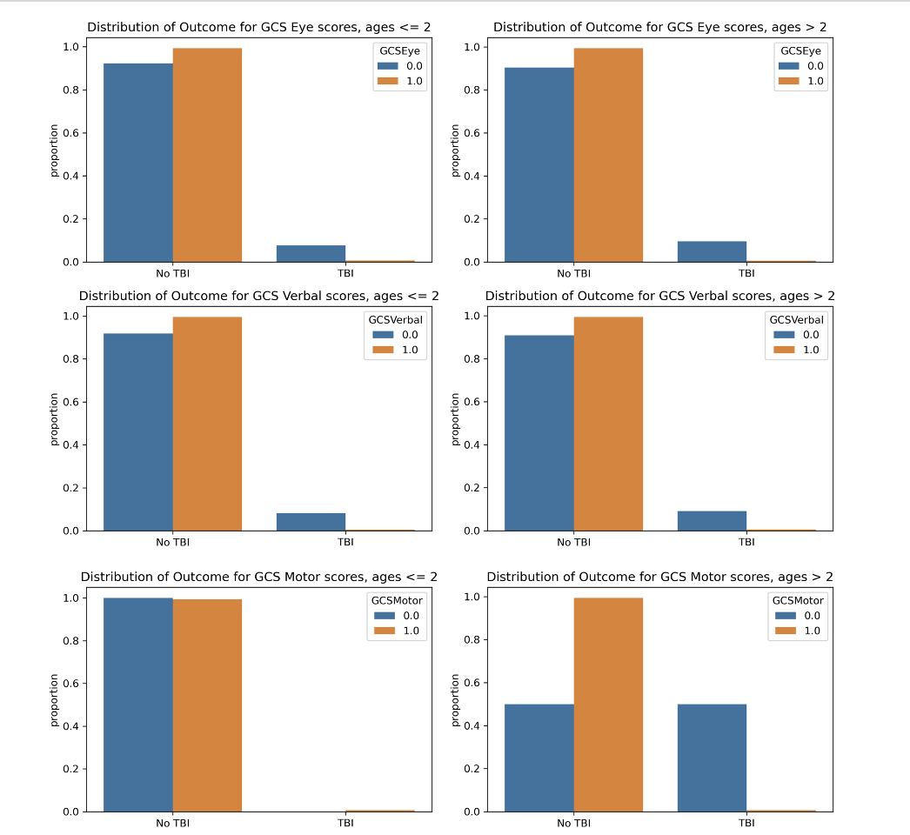
```

In this figure, we see that, for the GCS Eye scores and the GCS Verbal scores, the outcome conditional on suboptimal versus
optimal scores is distributed similarly across both age groups. This indicates that
the relationship between GCS score in these categories and the outcome is age invariant.
However, for the GCS Motor scores, we see that the distributions
are not the same. In fact, it seems like for individuals older than age 2, half
of individuals that had a suboptimal GCS Motor score ended up having a TBI, whereas
among children two or younger, a much smaller proportion of those with a suboptimal GCS Motor
score had a TBI. This tells us that there is likely some age dependence in how this
variable is related to TBI. So, when building an age-invariant classifier we also
wish to exclude the GCS scores.

Before moving on, we should also establish the age-invariant relationships of other
variables of interest with the outcome variable. Figure \ref{fig:no_age_dep}
shows that the distributions of the outcome conditional on having neurological deficits
or not, and having basilar skull fracture or not, are not age-dependent. This is as we would 
expect, since these injuries are observed directly by doctors and are not dependent upon 
verbal ability or any other factor directly associated with age.
Since the relationship of these indicators with the outcome are invariant to age,
we should certainly include variables like these in an age-invariant classifier.

```{r no_age_dep, fig.cap = 'Distributions of outcome conditional on neurological deficit and basilar skull fracture, across both age groups (1 indicates the presence of neurological deficit/basilar skull fracture).', out.width = "100%", echo = FALSE}
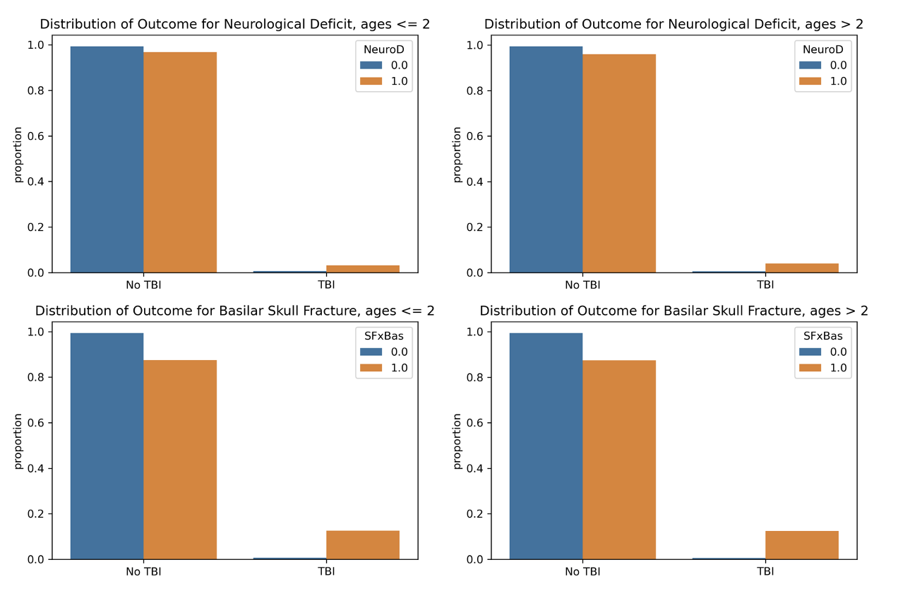
```

Finally, in making a classifier to vet and possibly improve upon that of Kuppermann et al.,
we explore the potential impact of including and excluding subvariable details. Recall
from Cleaning and Preprocessing that there are many categories which can be thought
of as parent categories (Altered mental status? Neurological Deficit? Basilar skull fracture?),
with children subcategories that provide more detailed information about the parent
category (if altered mental status, is it because you are sleepy? Agitated? Asking repetitive questions?).
In making an interpretable classifier with high predictive accuracy and a low false
negative rate with which to compare to Kuppermann's, there are arguments for and 
against including this subvariable information.

On the one hand, it is possible that certain subvariables are more predictive
of the outcome than other subvariables. Consider Figure \ref{fig:subvariable_arg},
which shows the correlations of the different subvariables for two parent variables, altered mental status
and basilar skull fracture, with the outcome. Each subvariable is binary encoded:
if the individual has any of the qualities, it is marked as 1, otherwise, it is marked
as 0. For AMS, it seems 'Sleepy', 'Slow to Respond', and 'Agitated' are much more correlated
with the outcome than 'Repetitive'. Even more so, for basilar skull fracture, it seems
'Hemotympanum' is much more highly correlated with the outcome than the other
variables. If we were to exclude this subvariable information in lieu of only including
an indicator for basilar skull fracture, it is possible that we could over-indicate
TBIs. Imagine if a child came into the emergency room with CSF Rhinorrhea, 
but our classifier only considers whether there is a sign of skull fracture.
Skull fracture, as an umbrella variable, might be an important predictor, but only because hemotympanum is so correlated
with the outcome. Thus, the child would probably be recommended to have a CT scan. However,
the child may not have had a TBI in the first place because CSF Rhinorrhea is not
very correlated with the outcome. Since we would be giving a child an unneeded CT scan,
it could be important to include this subvariable information in an ideal dataset.

```{r subvariable_arg, fig.cap='Subvariables of AMS (altered mental status) and basilar skull fracture are correlated differently with the outcome.', out.width='100%', echo = FALSE}
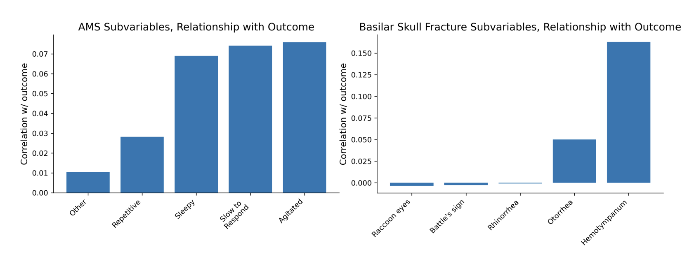
```

However, a clear argument against including this subvariable information is that
including too many variables may lead to very uninterpretable and nonsensical rules
that are the result of overfitting. Additionally, it seems like the parent variables alone
are substantially correlated with the outcome, as is shown in Figures \ref{fig:younger_corr}
and \ref{fig:older_corr}. So, in order to achieve a suitable dataset to make
interpretable and accurate classifiers with which to vet and improve upon Kuppermann's, it seems like
it may be suitable to just include the parent variables. Note also that the following two
plots further show the dataset is suitable for making an age-invariant classifier:
among the age-invariant variables, the correlations with the outcome are almost
identical across age groups.

```{r younger_corr, fig.cap = 'Among children 2 and younger, relevant parent variables seem substantially correlated with the outcome.', out.width = "80%", echo = FALSE}
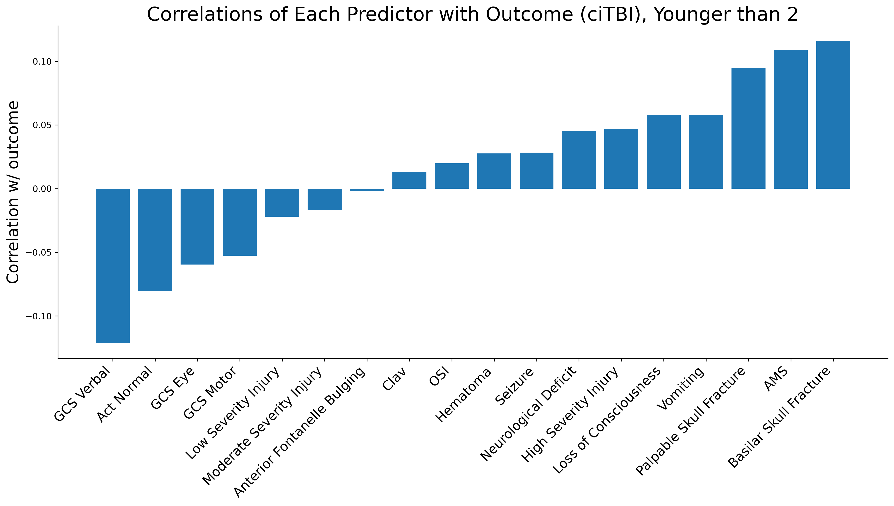
```

```{r older_corr, fig.cap = 'Among children older than 2, relevant parent variables seem substantially correlated with the outcome.', out.width='80%', echo = FALSE}
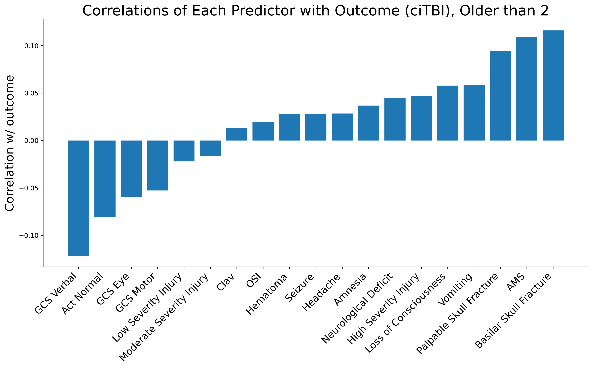
```

# Models

## Baseline Model

We choose the model proposed by Kuppermann and his colleagues as the baseline model
with which to predict whether a child will have a clinically-important TBI.
To evaluate their model, we also use the provided dataset cleaned similarly to theirs, 
consisting of 42412 children presenting to the emergency room 
due to the head trauma with GCS scores 14 and above and with the final outcome non-missing.
376 of these observations experienced clinically-important TBIs.
In addition, we also use the same age splitting method as Kuppermann,
where we use their baseline classifier for preverbal children (< 2 years of age)
to predict TBI in this subgroup, and the classifier for verbal children (2 years and older)
to predict TBI in this subgroup.

### Description

The age-based classifiers in Kuppermann et al. are rule-list models, or a models consisting of a list of rules, 
ordered by importance in indicating a TBI.
A child is labelled as having a TBI if and only if this 
child satisfies at least one of the rules, where the rules are checked in the aforementioned order of importance.
Once we come across a rule that the child satisfies, we stop checking. 
Therefore, based on the order, each rule is applied to different numbers of children.
The list below gives the rules for Kuppermann's pre-verbal (younger than 2) classifier.
Refer to Data Collection for a more in-depth description of the variables mentioned in each rule.

* Altered mental status (*AMS*)? If yes, TBI. If not, continue:

* Occipital, Parietal, or Temporal scalp hematoma (*HemaLoc*)? If yes, TBI. If not, continue:

* Loss of consciousness for more than 5 seconds (*LOCLen*)? If yes, TBI. If not, continue:

* Injury mechanism rated severe (*High_impact_InjSev*)? If yes, TBI. If not, continue:

* Palpable or unclear skull fracture (*SFxPalp*)? If yes, TBI. If not, continue:

* Acting normally according to parent (*ActNorm*)? If yes, TBI. If not, no TBI.

The list below now gives the rules for Kuppermann's verbal (2 or older) classifier.

* Altered mental status (*AMS*)? If yes, TBI. If not, continue:

* Loss of consciousness for more than 5 seconds (*LOCLen*)? If yes, TBI. If not, continue:

* Injury mechanism rated severe (*High_impact_InjSev*)? If yes, TBI. If not, continue:

* Basilar skull fracture (*SFxBas*)? If yes, TBI. If not, continue:

* Severe headache (*HA_Severity*)? If yes, TBI. If not, no TBI.

### Procedure and Performance

```{r baseline_res, echo = FALSE, fig.cap = 'Decision rule lists for clinically-important traumatic brain injury in children younger than 2 years and in those aged 2 years and older.',out.width="60%"}
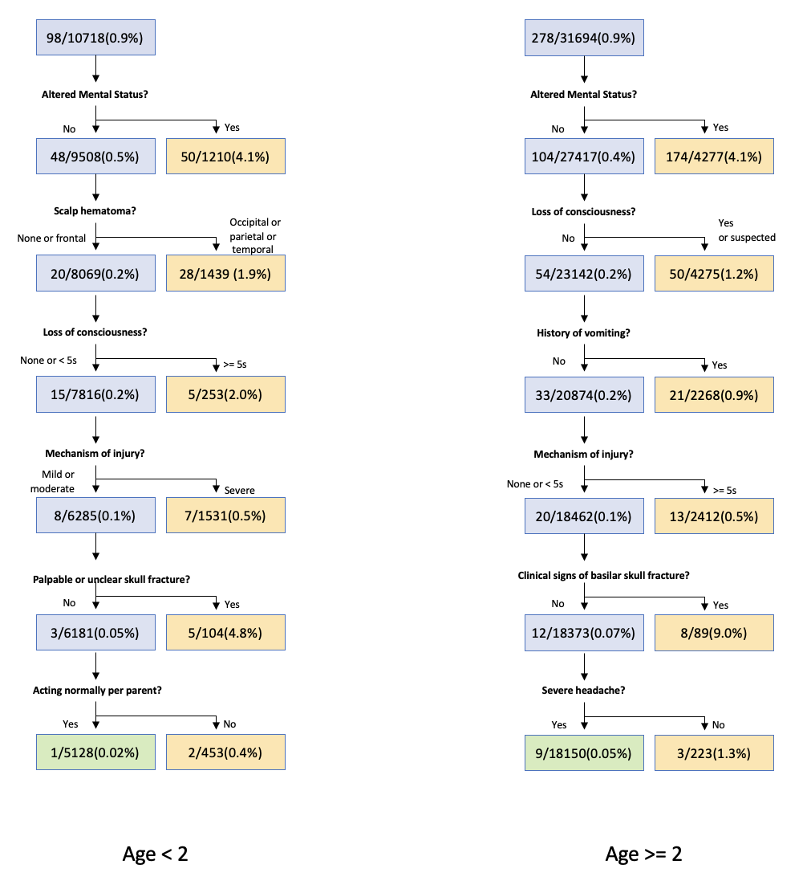
```

The result of baseline model is shown in \ref{fig:baseline_res}. The yellow blocks are identified as positive 
while the green blocks are identified as negative. In each block, the first number represents the number of children
experiencing clinically-important TBI, the second number is the number of children in this block, and
the last one represents the proportion. And we use the whole cleaned dataset to evaluate the model, 
while Kuppermann et al. splits the data into training set and validation set. The performance of the baseline classifiers
is similar to the result in Kuppermann et al. The baseline classifiers do identify almost all of the cases since 
the sensitivity is 98.9\% and 96.8\% for preverbal children and verbal children, respectively. However, the specificity only achieves
48.3\% and 57.7\%. In the following section, we propose a model with similar sensitivity and higher specificity. The detailed
evaluation metrics based on sensitivity and specificity is discussed in the following part.

\newpage

## Proposed Model

### `Rulefit`: Introduction and Basic Illustrative Implementation

*Rulefit* was proposed by @2008Friedman and is an example of a wider category of *ensemble methods*.
At a high level, we wish to describe our output function with a linear combination
of simpler learners $\mathcal{T}_k$ [@ESL]:

\begin{equation}
  f(x) = \sum_{k=1}^K \alpha_k~\mathcal{T}_k (x)
\end{equation}

The $\mathcal{T}$'s need not necessarily be analytic functions, so a common choice
is an ensemble of *trees*. Suppose we generated a large number of such trees in the first step, e.g. via a boosting
procedure. We then wish to make the linear combination as concise as possible.
A usual procedure is to perform a *LASSO* regression of regularization strength $\lambda$ on
the space of $\mathcal{T}$s for the coefficients $\alpha_k$:

\begin{equation}
  \alpha(\lambda) = \underset{\vec{\alpha}}{argmin} ~ \sum_{i=1}^N \mathcal{L}(y_i, \vec{\alpha_0} +
  \sum_{k=1}^N \alpha_k~\mathcal{T}_k (x)) ~+~ \lambda \sum_{k=1}^N |\alpha_k|
\end{equation}

We also added a linear term in all the original features $\vec{\alpha_0}$, which will come into play especially with 
the more complex models. The *LASSO* will for sufficiently large $\lambda$ set a large
portion of the coefficients to zero.


*Rulefit* follows the above procedure with an additional twist. After fitting the
trees via a gradient-boosting algorithm, it extracts *rules* from the generated tree.
Looking at a tree as a [*trie*](https://en.wikipedia.org/wiki/Trie), each path down a 
tree encodes a specific combined rule (each node is split solely on a single variable).
Naturally, the deeper the tree, the more complex a rule can get.
It can be shown [@ESL] that only the paths ending in leaf nodes describe all the rules for
the whole tree.

Thus the input to the sum above are the sets of such rules from each tree in the original
gradient-boosting sequence, which are most often overlapping.

The *LASSO* thus performs regression on the *space of rules* and outputs a parsimonious
set with potentially added linear terms.

As a concrete illustration of `rulefit` in conjunction with our preprocessing and
judgment call procedure, we present two models:

  * **"basic":**
    The judgment calls are selected as to be maximally restrictive, combining
    all sub-variables into their parent variable and throwing away as many of the rest as possible, 
    as well selecting the call of removing observations whenever possible. The number of
    rules is restricted to 10.

  * **"full":**
    The inverse of the above, including as many variables and throwing away as
    few observations as possible. The number of rules is allowed to go to 20.

These two classifiers should, therefore, illustrate the effects of our judgment calls on the 
structure of the model.


Below are presented the top five rules for each in terms of their importance. The
latter is similar to the metric in the ensemble of trees, but calculated from the
*LASSO* re-fitting [@molnar2019]:

```{python basic_rules, engine.path = "../../../../rule-env/bin/python3", include=FALSE}
# load the statistics from the basic

import pickle as pk
import imodels

basic = pk.load(open("notebooks/models/basic.pkl", 'rb'))
maximal = pk.load(open("notebooks/models/maxim.pkl", 'rb'))

brules = basic.get_rules().sort_values("importance", ascending=False).round(2).head(5)
mrules = maximal.get_rules().sort_values("importance", ascending=False).round(2).head(5)

```

```{r, echo=FALSE}
kable(py$brules, caption = "Top 5 basic model rules in order of importance")
```

```{r, echo=FALSE}
kable(py$mrules, caption = "Top 5 full model rules in order of importance")
```

We can immediately sense the increase in complexity for the *full* model.
Also note that the *LASSO*-introduced linear terms become important in the complex model,
perhaps substituting some of the effect of simpler rules.

To see how these relatively basic models perform, we examine their *sensitivity - specificity* curve in Figure \ref{fig:rule_result_on_test} 
with labeling 'Intro Minimal' and 'Intro Full'.
The minimal model is able to achieve 80%+ in both sensitivity and specificity for one
threshold value; since we care much more about false negatives than positives, we consequently value
sensitivity far above specificity. Therefore in this case, the fuller model with sensitivities
above 90% would be preferred.

Comparing these basic rules with the performance of the final model in @kuppermann2009,
which got approximately 96% sensitivity with 58% specificity, we can surmise that in the case of the
full model we are approaching that sensitivity and exceeding it in specificity, without any
specific tweaking to the models being performed at this stage!

As shown in the next section, with some careful construction of the models and selection
of the judgment call, we can improve this performance considerably.

### Procedure and Performance

We train and evaluate the models on our cleaned data based on different age-splitting methods and different judgment calls.
There are three possible splitting methods in age groups: preverbal children, verbal children, and all children.
We also include two different judgment calls: whether to include or exclude all subvariables.
Although there are six possible datasets, the dataset of preverbal children excluding subvariables contain too few
TBI children so we cannot get a reasonable result. Therefore, we will train and evaluate for the other five datasets.

For each possible dataset, we split 20\% of the data into the test data, which will only be used in the model evaluation,
while we use the remaining 80\% to fine-tune the hyperparameters and fit the model. Then we split four cross-validation 
folds to tune the hyperparameters for each model. Since this is an unbalanced dataset, raw classification accuracy will be
a poor means of evaluating the model, as a model that simply predicts that no children have a TBI would be more than 99% accurate. 
The best classifier should identify almost all of TBI cases, as well as identify most of children not experiencing TBI as no TBI. 
Therefore, we define our evaluation measure as follows.

\[ \text{score}=\left \{
\begin{aligned} 
& 5 \times \text{sensitivity} + \text{specificity}, \quad \text{if } \text{specificity} > 0.5.\\
&0, \quad \text{if } \text{specificity} \le 0.5.
\end{aligned}
\right.
\]

To evaluate the performance, we also aim to train one model to get similar results to the baseline model, which 
is a rule list model.
`FIXME: ? Andrej - we pick rulefit and not CART, so this sentence is wrong`
In our report, we pick one specific rule list model, i.e., greedy rule list (CART) model.
The greedy rule list (CART) model consists of a list of rules, which makes it 
simple to understand, interpret, and pick the important features.
For both greedy rule list model and rulefit model, we use the same procedure to train and validate, and evaluate
the performance on the test data. The only difference is the hyperparameters we aim to tune in the cross-validation procudure.

For the greedy rule list model, the hyperparameters are class weights (representing the importance of children experiencing TBI) and 
the maximum number of rules in the list (representing the complexity and the interpretability); for the rulefit model, 
the hyperparameter is the maximum length for each rule. In addition, since our rulefit model involves subsampling in generating the rules, 
the performance may vary even if we choose same hyperparameters. Therefore, for our rulefit model, we also need to run the models 
with different random states and pick the best one as the result, given the maximum length for each rule. Based on the cross-validation results, we pick the best hyperparameters and evaluate the performance on our test data.

The greedy rule list model performs quite poorly. For two datasets excluding the subvariables, the largest mean scores 
in our CV folds are smaller than 3, which implies the sensitivity is smaller than 60\%. For the datasets including subvariables,
although the largest mean scores are over 4, the scores on the test data are much smaller. This means the greedy rule list model
is very sensitive to the training data and will not behave well on the test data.

```{r rule_result_on_test, echo = FALSE, fig.cap = 'ROC curves of fine-tuned rulefit models on the test data for all five datasets.', out.width = "90%"}
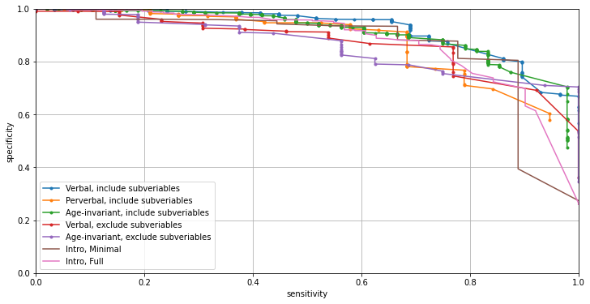
```

The performance of our rulefit model on test data can be found in Figure \ref{fig:rule_result_on_test}. 
We can find that the age-invariant group performs quite well. As the sensitivity achieves almost 100\%, the specificity is larger than 70\%. 
And including subvariables increases the model's performance when classifying verbal children. Among the two verbal children datasets, when sensitivity 
is larger than 95\%, the specificity is about 70\% when we include subvariables, while it drops to 55\% if we exclude them. Finally, for 
preverbal children,the specificity is around 60\% when the sensitivity is about 95\%. These results imply that we should develop an age-invariant
classifier as opposed to splitting the data as Kuppermann et al. did. In addition, when we perform the classification, we also need to pick 
a probability threshold to determine the predicted labels. For the age-invariant classifier, based on our discussion of sensitivity and stability, 
the threshold is set to $1.3 \times 10^{-5}$, which persform well not only on training and validation data, but also on test data.
For test data classification, the sensitivity is 97.9\% and the specificity is 70.4\%.

```{r rulefit_interpretation, echo = FALSE, fig.cap = 'The important rules for the age-invariant classifier', out.width = "100%"}
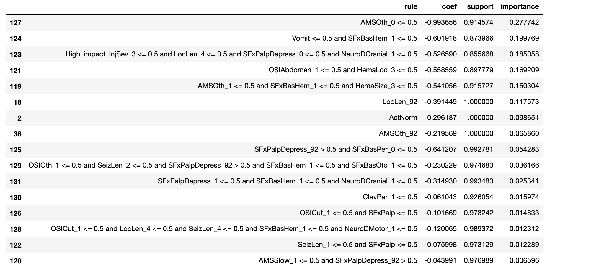
```

In Figure \ref{fig:rule_result_on_test}, we lists the important rules for the age-invariant classifier.
We find that other signs of altered mental status is the most important linear factor. Other important linear factors include
loss of consciousness length and history of vomiting. In addition to our linear predictors, we have numerous
binary rules that appear in our classifier, the most important of which are history of vomiting and basilar skull fracture (hemotympanum).
Other important rules involve the severity of injury, loss of consciousness length, depression in a palpable skull fracture, and 
neurological deficit in the cranial nerve.

### Randomness Assessment

The randomness in the data can be divided into two categories: *intrinsic* and *measurement-related*.

Under intrinsic randomness we can include the natural variation in people's physiologies, where the same
kind of injury might lead to a TBI in one child, but not in another, as well as the minute differences 
in the injury mechanics beyond the broader categories evaluated that might spare one child and not another 
from developing a TBI. Even if our rules somehow covered all the potential avenues to *ciTBI*, these
would, together with potential additional confounding factors, still make the prediction a
probabilistic exercise, not a deterministic one.

To the above, we can add the many sources of *measurement-related* randomness: many
of the variables are subjective evaluations performed by the clinical personnel, the 
parents, or the children themselves (verbal indication of a headache, for example).
These variables containing a degree of random "noise" should be obvious. As Dr. Inglis pointed
out, however, an experienced physician might also *encode* a degree of domain knowledge - colloquially, "gut feel" - 
in some of these categories, making them a stronger instead of a weaker predictor.

A potential trap in understanding the model is to see it as a causal "if-then" model, 
such as the baseline one. As shown in [`Rulefit`: Introduction and Basic Illustrative Implementation], the 
rules instead act in an additive fashion, each adding a degree of certainty in the outcome.
Additionally, the model itself is random. While the *LASSO* procedure in step 2 is 
deterministic, it can only select rules from the initial bag given.

The latter is generated via a tree generation procedure, which is most commonly *not deterministic* 
(gradient boosting, for example, performs subsampling). This randomness in rule generation
is somewhat ameliorated by the large number of trees we are generating, 
which should work towards obtaining the set of all feasible rules.

There is also a kind of arbitrariness in using the $L_1$ penalty, i.e. *LASSO*, as opposed to 
others in the feature selection step, which is going to privilege some rules above the others
without a domain-based reason.

However, we can argue that physicians themselves follow an analogous heuristic when evaluating
alternative hypotheses for a diagnosis: since the realm of possible causes is usually exceedingly large,
they restrict themselves to a set of plausible causes using a "gut-feel" that could be likened
to the $L_1$ shrinkage employed by the *LASSO*.

### Stability Analysis

In our stability analysis, we focus our efforts on checking both the stability of the
derived rules and feature importance subject to data and model perturbations, as well as
the stability of our classification results subject to data perturbations of the test set.

#### Feature Stability

To address the former, we can first compare the isolated features with those of the
classifier from Kupperman et al., whose results are presented in Baseline Model.
We cleaned our data differently, so this is a stability assessment of the rules
subject to data perturbations. Additionally, we use different classifier methods,
giving us a sense of stability subject to model perturbations. Note that there is
significant overlap between the rules of Kupperman's two age-dependent classifiers,
and most of the isolated rules are for variables we consider to be age-invariant.
So, comparisons between these two models will be meaningful. 

Looking at the first few variables isolated in Figure \ref{fig:rulefit_interpretation},
we see that the individual having altered mental status, a history of vomiting,
hemotympanum (sign of basilar skull fracture), an injury rated 'severe', loss of consciousness
for more than 5 seconds, and neurological deficits related to the cranial nerve,
and a parietal or temporal scalp hematoma are of utmost importance in determining
if someone has a clinically-important TBI. Compared to the baseline classifier's variables in 
Figure \ref{fig:baseline_res}, we see that all of these variables are included in
their rules to some extent. In fact, sometimes our classifier isolates a more
specific version of a parent variable. For instance, while the baseline classifier
isolates general signs of basilar skull fracture, we isolate a particular sign (hemotympanum),
and while the baseline simply checks for parietal, temporal, or occipital scalp hematoma,
we find that only parietal and temporal hematomas are of most use.

The next models to which we will compare our best classifier is an age-invariant random
forest classifier.
For our random forest, the judgement calls used to obtain the dataset were those that flattened the data, 
removing the umbrella variables and giving the variables below them a binary classification. 
We also removed age-variant predictors such as GCS. To create our cross-validation structure, we withheld 
a random sample of 4739 observations for validation, stratified on outcome level. From there, the remaining 
30,000 observations were randomly split into three equal folds, likewise stratified, and used to run a 
three-fold CV in order to evaluate a given model's sensitivity and specificity, averaged over the three 
possible train-test splits. 

With the folds set up, we use this average sensitivity and specificity to tune our model's hyperparameters.
One possible hyperparameter, number of trees, was found during exploratory analysis to have functionally no 
effect on anything except computation time beyond around 200 trees, so all models were run with 200 trees.
The forest's maximum depth, on the other hand, was optimized over, as an increase in max depth would generally
result in an increase in specificity at the expense of sensitivity. The unbalanced nature of our output
(less than 1% of children actually had a TBI) leads us to another hyperparameter: weight. Essentially, if we
do not weight our model in order to favor true positives over true negatives, any random forest will always predict
that the child does not have a TBI; thus we add a weight factor to our "1" outcome in order to increase our model's sensitivity.

The values evaluated for our hyperparameters (chosen via cursory exploratory analysis) include max depth ranging
from 5 to 11 and weight parameter evaluated at 1 and then every multiple of 100, up to 1000. We optimized over both of
these parameters, testing a total of 77 models for the ideal model that maximizes our aforementioned evaluation measure of 
2(Sens) + Spec, Spec>0.5, and generated ROC curves for each max depth, which can be seen in `tbi_rf.pdf`. 

`(Xin) i think we should not refer tbi_rf.pdf n our report. And for RF Importance features, we do not need it to be a plot I think. But I'm not sure how to do this..`

```{r RF importance, echo = FALSE, fig.cap = 'Top 6 most important predictors in final RF', out.width = '100%'}
include_graphics('figs/RF Importance.PNG')
```
Our final random forest model ended up having depth 8 and weight 400, and when applied to the validation dataset, it demonstrated an 
impressive sensitivity of 0.971 and specificity of 0.617- slightly worse than our best classifier, but better than Kuppermann's 
classifier and overall good given our aforementioned preference for sensitivity over specificity. In terms of importance, 
hemotympamnum was by far the most important predictor, which is entirely in keeping with its high prevalence in our rule-fitting 
model. Other important factors included ActNorm, ClavPar (scalp trauma), and AMSSlow- all of which show up somewhere in rules 
as well. Somewhat curiously, no vomiting-related predictors were in the top 6 (highest was VomitLast=1 which was 13th most important) 
despite its high prevalence in our rule-fitting classifier; this may be a consequence of the flattening of the vomit variable, 
leaving us with many minor effects instead of the one overall binary indicator of whether or not the child was vomiting.

#### Classification Result Stability

To check the classification result stability, we run through a cartesian product
of our possible perturbations for our judgement calls and, using our best classifier,
predict on this perturbed test data for each combination of judgement calls. Because
many of our judgement calls had to do with the inclusion/exclusion of certain sets of columns,
for which it would be impossible to evaluate a model trained on a different feature space,
we choose a set of 5 judgement calls, along with their perturbations, that involve
imputing/dropping missing values and recoding categories. Please refer to Data Collection
for a dictionary of the judgement calls and their perturbations.

+ original judgement call: [`SFx`]; perturbation 2
+ original judgement call: [`Seiz`]; perturbation 2
+ original judgement call: [`LOC`]; perturbation 2
+ original judgement call: [`ActNorm`]; perturbation (only perturbation listed)
+ original judgement call: [`Vomit`]; perturbation (only perturbation listed)

This set of judgement calls effectively covers perturbations due to the inclusion or
exclusion of missing values, imputation of missing values, as well as recoding
observations. For instance, [`SFx`] and [`LOC`] are both judgement calls where
a result marked 'unclear' was coded as 'true'. An interesting perturbation would be
to see if coding these observations as 'false' changes the results substantially.

We loop through every possible combination of the above 5 judgement calls and their
perturbations and obtain a test dataset (32 test datasets in total). For each of those
sets, we evaluate the sensitivity and specificity using our best rulefit model.
A histogram of specificities and sensitivities are provided in Figure \ref{fig:perturb_res}

```{r perturb_res, echo=FALSE, fig.cap = 'The sensitivity and specificity are fairly stable, with specificity being slightly more so than sensitivity.', out.width = "100%"}
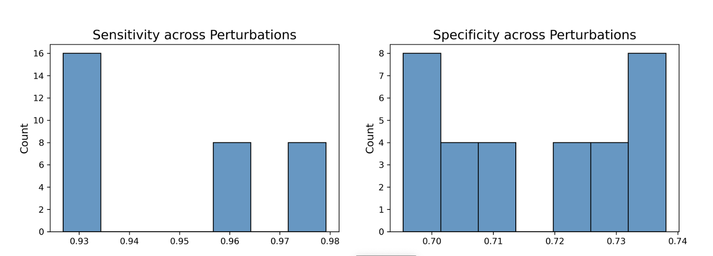
```

In Figure \ref{fig:perturb_res}, we see that, subject to these different combinations of judgement calls and
their perturbations, the sensitivities and specificities are quite stable. We note that,
in a large number of the judgement call combinations, the sensitivity drops to around
0.92 to 0.93. Upon further examination, it seems this sensitivity occurs when the 
perturbation for [`Vomit`] is applied. Instead of imputing missing values
from the subvariable columns as in the [`Vomit`] judgement call, the perturbation
drops any observation for which any of the subvariables or parent variables are missing,
the reason being that if any of the criteria is missing, any provided results
cannot be trusted. However, a counterargument would be that the physician could have
been tired and possibly skipped through some of the subcategories, or felt that
marking a the main vomit category after having marked a subcategory was redundant.
So, while our results are slightly impacted by this perturbation, we should take this
with a grain of salt.

# Discussion

*Discuss the performance, the results, the stability subject to perturbations,*
*how well it compared to the baseline, etc.*

Additionally, on the testing set, our best classifier only had one false negative:
patient number 5295, a four year-old Black male. Upon examining his covariates, it seems the only abnormal
responses were the presence of a large frontal hematoma, an above-the-clavicle injury on the frontal part of the scalp, 
an injury mechanism of moderate severity. Every other covariate was listed as normal.
With such a patient, Kuppermann's classifier would also have listed him as not having a TBI.
So, while it is unfortunate that we would have misclassified this individual and
decided not to pursue a CT scan, the classifier we wish to improve upon would have
also missed this diagnosis. This may indicate the need for new features to observe
when collecting data to ensure no TBIs are missed in the future.

By checking the top rules in Figure \ref{fig:rulefit_interpretation}, our best classifier shows
altered mental status, the history of vomiting, basilar skull fracture(hemotympanum), severity of injury,
loss of consciousness for more than 5 seconds, and neurological deficit(cranial nerve) are of vital importance when
classifying the clinically-important TBI. As we mentioned in stability section, the results of the baseline classifier
supports our result. Moreover, our classifier can also identify one particular important subvariable of a parent variable.
While our classifier keeps almost 100\% sensitivity, the specificity also improves to about 70\%, 
which is higher than that of the baseline classifier. Moveover, based on results of our data processing and modeling,
we show that splliting children by age is not a good idea. The dataset is unbalanced, and the the number of preverbal children experiencing
TBI is quite small, which will influence the performance of fitted models.

Moreover, the important features identified by our classifier are not only match the baseline model results, but also
random forests model and rulefit model fitted by exluding all subvariables. Therefore, the important features are very stable.
And when we apply different combinations of judgement calls and perturbations of the data, the sensitivities and specificities
are also quite stable at most of the circumstances. 


*Discuss future directions on what we can do (other models, other perturbations,*
*things we missed that we would have done with more time, etc.)*

In the future, we would fit more interpretable models. Our best classifier is based on rulefit model, which in general provides
less interpretability than the rule list model in the baseline classifier. Although we takes the rule list model into account
when picking the best classifiers, the greedy (CART) rule list model does not perform well. It has lower sensitivity and is not stable
to the data perturbation. We would have tried other types rule list models to see whether we can get a stable model with 
high sensitivity and specificity, as well as more interpretability. And we may apply other judgement calls to fit the models, to check
for each parent variable, whether we should keep the parent variable or use its one specific subvariable in the data.

# Conclusion

In this paper, we utilize the same data as Kuppermann to develop interpretable rules to identify whether the children 
presenting to the emergency room for head trauma are at high or low risk of having TBIs. Those at low risk can avoid CT scans,
and we also want to ensure children who avoiding CT scans indeed have very low risk of experiencing TBIs. We clean and preprocess the data
and deal with the umbrella variable structure as judgment calls. Then we performs EDA and modeling to pick our best classifier, which
is built on age-invariant data and including the subvariables. It's sensitivity and specificity outperforms the baseline models derived by
Kuppermann and his colleagues. The corresponding important features selected by our model are altered mental status, 
the history of vomiting, basilar skull fracture(hemotympanum), severity of injury,
loss of consciousness for more than 5 seconds, and neurological deficit(cranial nerve),
which matches the baseline models and other models we fit to some extent. The sensitivity and the specificity is also quite stable
when we perform the data perturbation. And our model can be generalized to the future data based on our assessment to the randomness 
of the data and the model, the domain knowledge of the covariates and theirs relationships to TBI in EDA, and the stability discussion of
the best classifiers.


# References

Special thanks to Dr. Rob Inglis of UCSF for graciously offering his time and expertise
to discuss our results!

